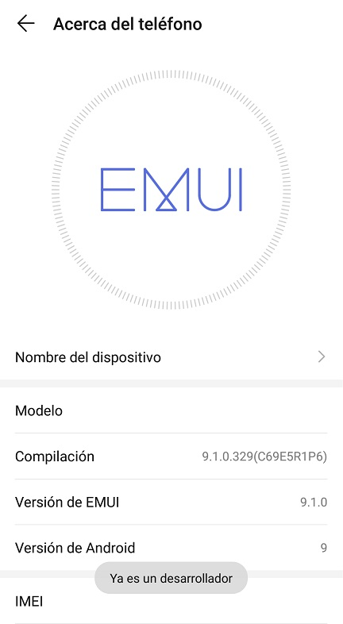

# Pentesting con adb 

## TEMAS

* [¿De qué se trata esto?](#¿De-qué-se-trata-esto?)
* [¿Qué es Android Debug Bridge (adb)?](#¿Qué-es-Android-Debug-Bridge-(adb)?)
* [¿Cómo activar/deshabilitar ADB en android?](#¿Cómo-activar/deshabilitar-ADB-en-android?)
  * [Activar ADB](#Activar-ADB)

## ¿De qué se trata esto?

En este escrito se tratará de explicar de manera general que es Android Debug Bridge, como poder empezar a trabajar en el desde un sistema linux o windows, pasando por los comandos mas usados y dando un enfoque al pentensting usando este servicio.  

## ¿Qué es Android Debug Bridge (adb)?

Android Debug Bridge (ADB) es una herramienta de línea de comandos que viene incluida con el SDK de Android, permite a los desarrolladores comunicarse con un 
emulador o un dispositivo Android conectado directamente desde la línea de comandos.

 El comando adb permite realizar una variedad de acciones en el dispositivo, como instalar y depurar apps, y proporciona acceso a un shell de Unix que puedes usar para ejecutar distintos comandos en un dispositivo. Es un programa cliente-servidor que incluye tres componentes:

 * Un cliente, que envía comandos. El cliente se ejecuta en tu máquina de desarrollo. Puedes invocar un cliente desde un terminal de línea de comandos emitiendo un comando adb.
 
* Un daemon (adbd), que ejecuta comandos en un dispositivo. El daemon se ejecuta como un proceso en segundo plano en cada dispositivo.

* Un servidor, que administra la comunicación entre el cliente y el daemon. El servidor se ejecuta como un proceso en segundo plano, en tu máquina de desarrollo.

## ¿Cómo activar/deshabilitar ADB en android?

### Activar ADB

Para tener activada la herramienta en nuestro android primero tenemos que habilitar la opcion de "depuración de USB", para eso seguimos los siguientes pasos:

1 - En nuesto andoid tenemos que ir a la siguiente ruta: Ajustes/sistema/Acerca del telefono.

En donde encontraremos la información de nuestro dispositivo.

2 - Tenemos que dar pulsar el apartado de compilacion hasta que nos salte la siguente leyenda: "Ya es un desarrollador": 

3 - Una vez hecho el paso anterior se nos desbloqueará una nueva seccion de opciones en nuestro android, la cual estará en la siguiente ruta: Ajustes/sistema/Opciones de desarrollador.

4 - Por último, dentro de esa nueva seccion encontramos la opcion de "Depuracion USB" y la activamos. 

Listo, de esta manera tendrémos activada esta herramienta en nuestro celular. 

### Deshabilitar ADB

Para deshabilitar esta opcion solo volvemos al punto 4 anterior y lo desactivamos.

