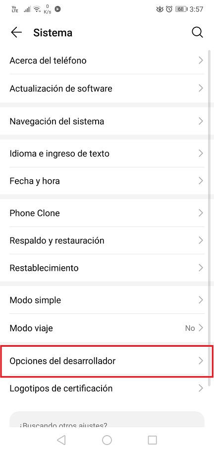
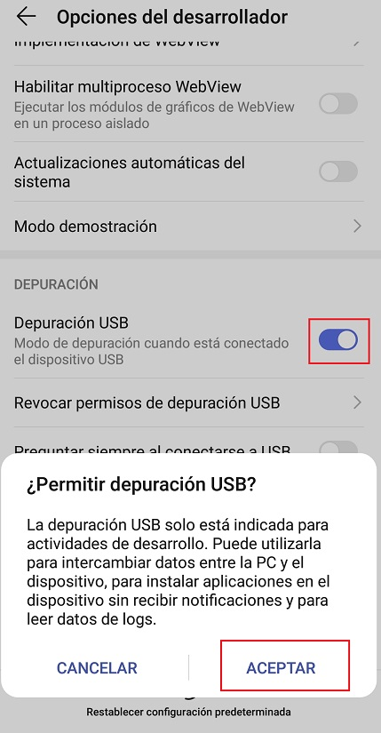

# Pentesting con adb


## TEMAS

* [¿De qué se trata esto?](#¿De-qué-se-trata-esto?)
* [¿Qué es Android Debug Bridge (adb)?](#¿Qué-es-Android-Debug-Bridge-(adb)?)
* [¿Cómo activar/deshabilitar ADB en android?](#¿Cómo-activar/deshabilitar-ADB-en-android?)
  * [Activar ADB](#Activar-ADB)
  * [Deshabilitar ADB](#Deshabilitar-ADB)
* [Instalar el servicio adb en diferentes sistemas](#Instalar-el-servicio-adb-en-diferentes-sistemas)
  * [Windows](#Windows)
  * [Linux](#Linux)
  * [Android](#Android)
* [Uso básico de ADB](#Uso-básico-de-ADB)
* [Listado de comandos ADB más utilizados
](#Listado-de-comandos-ADB-más-utilizados
)
* [¿Pentesting con ADB?](#¿Pentesting-con-ADB?)
  
  
  
## ¿De qué se trata esto?

En este escrito se tratará de explicar de manera general que es Android Debug Bridge, como poder empezar a trabajar en el desde un sistema linux o windows, pasando por los comandos mas usados y dando un enfoque al pentensting usando este servicio.  


## ¿Qué es Android Debug Bridge (adb)?

Android Debug Bridge (ADB) es una herramienta de línea de comandos que viene incluida con el SDK de Android, permite a los desarrolladores comunicarse con un 
emulador o un dispositivo Android conectado directamente desde la línea de comandos.

 El comando adb permite realizar una variedad de acciones en el dispositivo, como instalar y depurar apps, y proporciona acceso a un shell de Unix que puedes usar para ejecutar distintos comandos en un dispositivo. Es un programa cliente-servidor que incluye tres componentes:

 * Un cliente, que envía comandos. El cliente se ejecuta en tu máquina de desarrollo. Puedes invocar un cliente desde un terminal de línea de comandos emitiendo un comando adb.
 
* Un daemon (adbd), que ejecuta comandos en un dispositivo. El daemon se ejecuta como un proceso en segundo plano en cada dispositivo.

* Un servidor, que administra la comunicación entre el cliente y el daemon. El servidor se ejecuta como un proceso en segundo plano, en tu máquina de desarrollo.


## ¿Cómo activar/deshabilitar ADB en android?

### Activar ADB

Para tener activada la herramienta en nuestro android primero tenemos que habilitar la opcion de "depuración de USB", para eso seguimos los siguientes pasos:

1 - En nuesto andoid tenemos que ir a la siguiente ruta: Ajustes/sistema/Acerca del telefono.

En donde encontraremos la información de nuestro dispositivo.

2 - Tenemos que dar pulsar el apartado de compilacion hasta que nos salte la siguente leyenda: "Ya es un desarrollador": 


3 - Una vez hecho el paso anterior se nos desbloqueará una nueva seccion de opciones en nuestro android, la cual estará en la siguiente ruta: Ajustes/sistema/Opciones de desarrollador.



4 - Por último, dentro de esa nueva seccion encontramos la opcion de "Depuracion USB" y la activamos. 



Listo, de esta manera tendrémos activada esta herramienta en nuestro celular. 

### Deshabilitar ADB

Para deshabilitar esta opcion solo volvemos al punto 4 anterior y lo desactivamos.

## Instalar el servicio adb en diferentes sistemas

Adb puede ser instalado en muchos sistemas

### Windows

Para instalar esta herramienta solo tenemos que irnos al siguiente link y descargar el instalador:

https://dl.google.com/android/installer_r24.4.1-windows.exe

### Linux

En linux este paso es dependiendo del sistema. Para sistemas Debian/Ubuntu y Fedora puedes instalar con apt-get y yum/dnf respectivamente los paquetes android-tools-adb y android-tools-fastboot

Debian/Ubuntu

```
sudo apt-get install android-tools-adb android-tools-fastboot

```
Fedora

```
dnf install android-tools

```
### Android

Para instalarlo en android tenemos que hacer uso de una aplicacion para simular una terminal, en este caso la aplicacion de TERMUX:

Entramos a termux y pegamos la siguente linea de comandos:

```
apt update > /dev/null 2>&1 && apt --assume-yes install wget > /dev/null 2>&1 && wget https://github.com/MasterDevX/Termux-ADB/raw/master/InstallTools.sh -q && bash InstallTools.sh

```
Para desinstalar:

```
apt update > /dev/null 2>&1 && apt --assume-yes install wget > /dev/null 2>&1 && wget https://github.com/MasterDevX/Termux-ADB/raw/master/RemoveTools.sh -q && bash RemoveTools.sh
```

## Uso básico de ADB

El uso de la herramienta ADB no varia dependiendo en el sistema en que este instalado, es decir, los comandos funcionan exactamente igual aun que se ejecuten desde linux o windows.

Los comandos básicos son los siguientes:

* Conectar con dispositivo:
         
         `adb connect [IP]:[PUERTO] (por defecto el 5555)`
         
* Listado de dispositivos

          `adb devices`
         
* Desconectar el dispositivo:

         `adb disconnect [IP]:[PUERTO]`       
        
## Listado de comandos ADB más utilizados
         

* Copiar un archivo al dispositivo:

         `adb push [RUTA-LOCAL] [RUTA-DISPOSITIVO]`

* Descargar un archivo desde el dispositivo:

         `adb pull [RUTA-DISPOSITIVO] [RUTA-LOCAL]`

* Reiniciar dispositivo:

         `adb reboot`

* Reiniciar dispositivo (arranque):

         `adb reboot-bootloader`

* Instalar APK:

         `adb install [APK]`

* Reinstalar APK:

         `adb -r install [APK]`

* Desinstalar APK:

         `adb uninstall [NOMBRE-PAQUETE-APLICACION]`

* Obtener shell del dispositivo:

         `adb shell`

* Iniciar una Activity (apk):

         `adb shell am start -n [PAQUETE-APLICACION]/.[ACTIVITY]`
         
          `adb shell am start -n [PAQUETE-APLICACION]/[ACTIVITY]`

* Tomar captura de pantalla:

         `adb shell screencap [RUTA-DISPOSITIVO]`

* Grabar pantalla del dispositivo:

         `adb shell screenrecord -time-limit [SEGUNDOS] [RUTA-DISPOSITIVO]`

* Emular botón encendido:

         `adb shell input keyevent 26`

* Emular pantalla de desbloqueo:

         `adb shell input keyevent 82`
         
* Listar paquetes instalados:

         `adb shell pm list packages`
         
* Logcat:

         `adb logcat`         
     
* Volcar datos del sistema en la pantalla:

         `adb shell dumpsys`

* Volcar datos del sistema en la pantalla enfocandonos en los servicios:

         `dumpsys | grep "DUMP OF SERVICE"`
         
* Volcar datos de un servicio específico:

         `adb shell dumpsys [servicio]`         

* Extraer APK:

         `adb shell pm path [NOMBRE-PAQUETE]`
         
* Mostrar información sobre CPU:

         `adb shell cat/proc/cpuinfo`         

* Habilitar datos móviles:

         `adb shell svc data enable`

* Deshabilitar datos móviles:

         `adb shell svc data disable`
         
* Localizar dispositivo

         `adb shell location`
         

## ¿Pentesting con ADB?

Como ya sabemos el Pentesting o también llamado test de penetración está diseñado para determinar el alcance de los fallos de seguridad de un sistema.

En este caso, aprovecharémos un fallo en esta herramienta, el cual perimite que un usuario pueda ver la direccion de los dispositivos que estan usando este servicio. Para esto utilizaremos el buscador SHODAN que es una herramienta fundamental para los pentesters.

Shodan es un motor de búsqueda en el que, a diferencia de Google y otros buscadores, no podemos buscar, por ejemplo, una imagen o un texto, Este motor de búsqueda está enfocado únicamente a buscar sistemas y servicios conectados a internet. Por este motivo, Shodan está clasificado como uno de los motores de búsquedas más peligrosos, por todo el contenido que tiene.

Podemos hacer todo tipo de búsquedas dentro de su ámbito, incluso podemos utilizar los dorks que incluye este motor de búsquedas.

En el buscador shodan usamos el siguiente dork:

     `product:”Android Debug Bridge”`
     
Este dork lo que hace es especificar al buscador que queremos encontrar un producto, y que el producto es android debug bridge, con lo cual nos responderá mostrandonos los dispositivos en los cuales el servicio de adb esta siendo ejecutado de manera online


Como pudemos observar, son muchos dispositivos en los cuales podríamos ingresar, esto es muy peligroso por que cualquier persona puede acceder a tu informacion.


